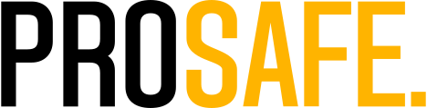

<p align="center">
  
</p>

# 🛡️ ProSafe – Safety Violation Detection System

A real-time monitoring system for detecting workers without helmets on construction sites using live camera streaming, YOLO-based detection, and a Next.js frontend.

---

---

## 🚀 Getting Started

### 1. Start the Frontend (Next.js)

```bash
cd client
npm install      # First-time setup
npm run dev      # Starts the frontend at http://localhost:3000
```

### 2. Start the Detection Service (FastAPI + YOLOv5)

```bash
cd detection-service
python -m venv env           # Create a virtual environment named 'env' to isolate project dependencies
.\env\Scripts\activate       # Activate the virtual environment (on Windows) 
pip install -r requirements.txt # Install requirements
uvicorn main:app --reload    # Available at http://localhost:8000
```

### 3. Start the Backend (Node.js)

```bash
cd server
npm install           # First-time setup
npm run dev           # Starts the backend at http://localhost:5000

```
